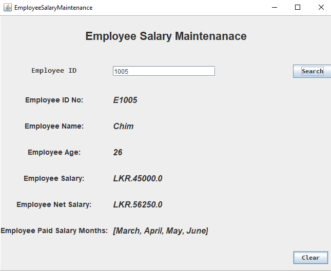

# employee-salary-maintenance-app
Hi 👋,
Thanks for checking out this application.

## Application Preview
This is what the application looks like,

This is what the application search results display like,

This is what the application error message displays like,

### The Challenge
My challenge is to built the simple application that could be user friendly and help to retrieve the data of employee from the database. To do this challenge, you need a basic understanding of JAVA and MYSQL.
